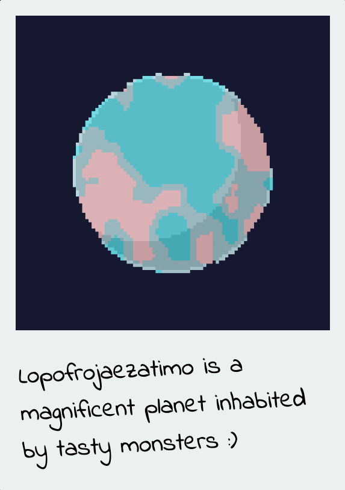
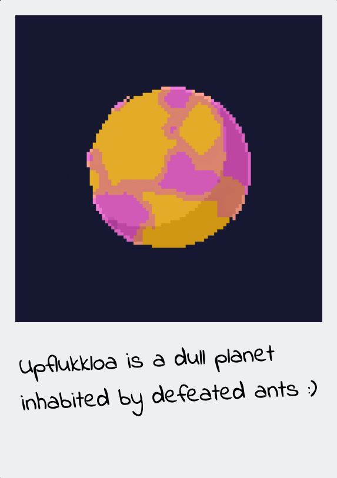
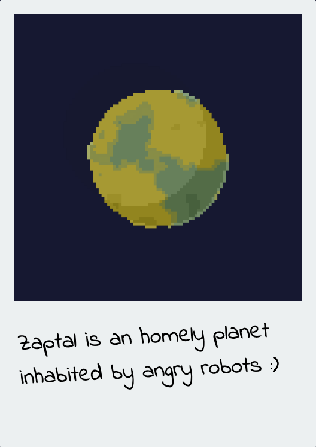
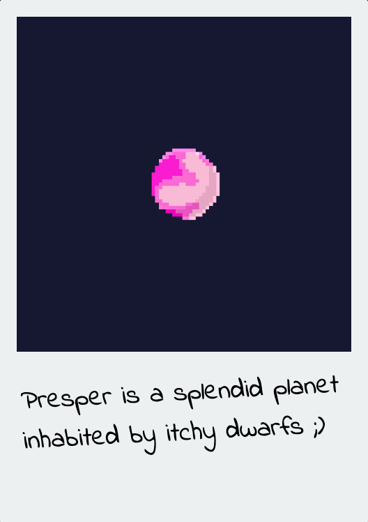

# Tiny Planets

> "An artistic project that generates random planets along with a random descritpion."

You can see them [here !](https://supermayo.github.io/tinyPlanets)

### Acknowledgement :

- [p5js](https://p5js.org/) as 2d renderer
- [Andres circle algorithm](https://fr.wikipedia.org/wiki/Algorithme_de_trac%C3%A9_de_cercle_d%27Andres#cite_note-1) (french only)
